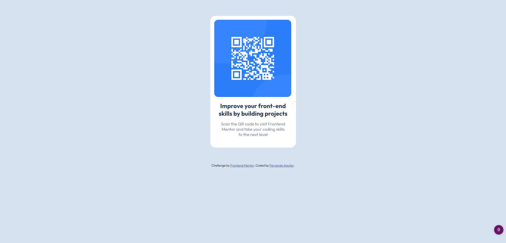

# Frontend Mentor - QR code component solution

This is a solution to the [QR code component challenge on Frontend Mentor](https://www.frontendmentor.io/challenges/qr-code-component-iux_sIO_H). Frontend Mentor challenges help you improve your coding skills by building realistic projects. 

## Table of contents

- [Overview](#overview)
  - [Screenshot](#screenshot)
  - [Links](#links)
- [My process](#my-process)
  - [Built with](#built-with)
  - [Useful resources](#useful-resources)
- [Author](#author)

## Overview

### Screenshot

### Links

- Solution URL: [Add solution URL here](https://your-solution-url.com)
- Live Site URL: [Add live site URL here](https://your-live-site-url.com)

## My process

### Built with

- Semantic HTML5 markup
- CSS custom properties
- Mobile-first workflow

### Useful resources

- [Example resource 1](https://www.youtube.com/c/CodingTube) - I saw about this challenges in this youtube channel (spanish) and learn how to prepare everything.

## Author

- Website - [Fernando Aguilar](https://www.ftxsistemas.com)
- Frontend Mentor - [@FernandoAguilar1](https://www.frontendmentor.io/profile/FernandoAguilar1)
- Github - [FernandoAguilar1](https://github.com/FernandoAguilar1)